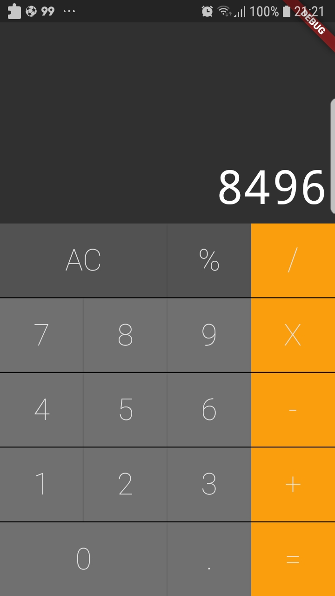
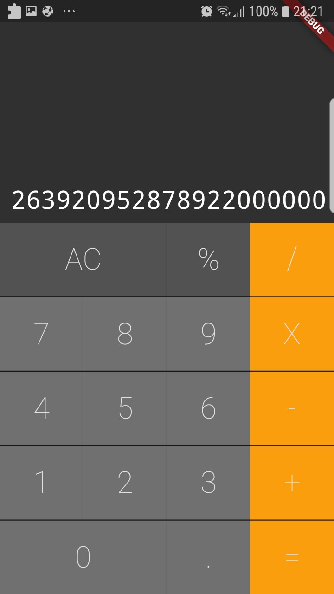

# calculadora

Uma simples calculadora criada em flutter acompanhando um tutorial no youtube.

# Imagem

## fonte

- [Tutorial Calculadora ](https://www.youtube.com/watch?v=jyjdXFsQoYw)
- [Cookbook: Useful Flutter samples](https://docs.flutter.dev/cookbook)
- [online documentation](https://docs.flutter.dev/)
